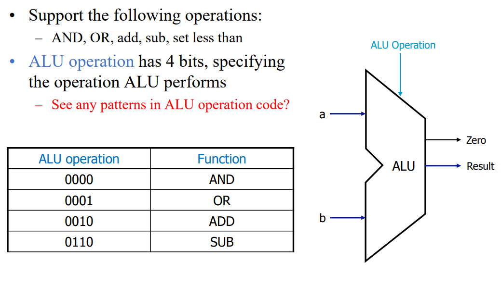
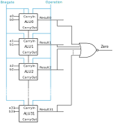

    [This
    page](https://github.com/zhijieshi/cse3666/blob/master/myhdl/signals.md)
    has brief explanations of signals and shadow signals.

## Description

We have discussed the interface of ALU in lecture, which is also shown in the
following figure. The ALU performs the operation specified by `alu_operation`
on two inputs `a` and `b` and generates `Result`. Output signal `zero` is 1 if
and only if all bits in `Result` are 0.

The internal circuit diagram of the 4-bit ALU is similar to a 32-bit ALU. See
`alu32.svg` directly if the figure does not shown below. Note that `bnegate`
and `operation` signals in the following diagram are bits from `alu_operation`.

### Steps ------------------------------------------------------------------------------------------

- Step 1. Create signals to be connected to the carryout and result ports of
  the 1-bit ALUs.

  In this lab, we store signals in separate variables, e.g., `c1`, `c2`,
  `c3`, and `c4`. When we are experienced and the design comes larger, We may
  choose to store the signals in a Python list.

- Step 2. Instantiate 1-bit ALUs. Connect correct signals to the input and
  output ports of 1-bit ALUs.

  The skeleton code already instantiates the first 1-bit ALU, ALU0. Follow
  the example and instantiate other three 1-bit ALUs. Another example of
  instantiating a block is in function `test_comb()`, which instantiates an
  ALU4bits.

- Step 3. Generat output signals `result` and `zero` of the 4-bit ALU from
  the output signals of 1-bit ALUs. The logic should be in `comb_output()`
  function. See the comments in the skeleton code.

### Running the program

The program `alu4.py` accepts a few arguments from the command line.

- The first positional argument is the operation code. The default value is
  -1, which goes through all operations: 0, 1, 2, and 6.

- `-a <number>`: specify the value at input `a`. The default value is 10.

  We cannot specify input `b` from the command line. The program sends all
  bit patterns, from 0b0000 to 0b1111, to input `b` of the ALU.

- `-h`: display the help message.

Here are some examples of running `alu4.py`.

    # use default setting. op = [0, 1, 2, 6]. a = 10.
    python alu4.py

    # test only addition. op = [2]. a = 10.
    python alu4.py 2

    # test subtraction. op = [6]. a = 15.
    python alu4.py 6 -a 15

The output of the program without any arguments is in `output.txt`. Test your
program with different input.

## Deliverables

Submit `alu4.py` in HuskyCT by the deadline.

Study the Overflow section before taking the test.

## Overflow

When performing addition/subtraction, we may not be able to represent the
result with the same number of bits, which is 4 in this lab. This is called
overflow. When overflow happends, the result from ALU is not correct. When
needed, software needs detect overflow and adjust the result.

The detection of overflow depends on how we interpret bits, signed or unsigned.
Study the output of the 4-bit ALU and identify the rows where you see overflow,
assuming 1) bits are signed and then 2) bits are unsigned.

Here is an example. The last line in `output.txt` is:

    0110         1010  1111 | 1011   0

The ALU performed subtraction.

If all bits are signed, we have -6 - (-1) = -5. The result is correct.

If all bits are unsigned, we have 10 - 15 = 11. The result is not correct.
